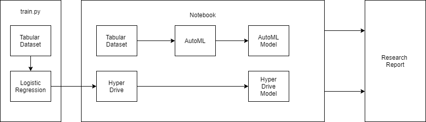

# Optimizing an ML Pipeline in Azure

## Overview
This project is part of the Udacity Azure ML Nanodegree.
In this project, we build and optimize an Azure ML pipeline using the Python SDK and a provided Scikit-learn model.
This model is then compared to an Azure AutoML run.

## Architecture 

This diagram will be referenced in later headings. 

## Summary
The [dataset](https://archive.ics.uci.edu/ml/datasets/Bank+Marketing) used in this project contains the information of a bank's prospective customers to whom direct marketing calls have been made. It contains such information as: age, marital status, job, duration of call etc. and we seek to predict if the customer will subscribe to a term deposit. In the dataset, this target is coded as the y variable with values: yes and no. 

This is thus a **classification** project. Additionally, we compare the performance of an AutoML model with a Logisitic Regression model tuned using AzureML's HyperDrive. As shown in the architecture Diagram above, building both models begins with creating with a **TabularDataset**, one of two Dataset classes available in Azure. Also, the dataset is cleaned using a clean_data function in [train.py](train.py) before being passed into either model. Naturally, the architectures differ from this point on. 

The performance of both models are comparable, reaching >91% accuracy. However, the AutoML model slightly edges the Logistic Regression model, reaching 91.60% compared to 91.59% accuracy. 
## Scikit-learn Pipeline
Data loading and cleaning are taken care of when [train.py](train.py) is run. This is the entry script for the **SKLearn** estimator fed into the HyperDrive config. The role of the HyperDrive is then to vary the parameters C and max_iter so that the best performing model is found. 

In order to achieve this, a parameter space and sampling method, an early termination policy, a primary metric name and goal must be provided as part of the hyperdrive config. 

The **RandomParameterSampling** method is used here. It draws parameters at random from the defined search space. As it does not perform an exhaustive or detailed search like Grid or Bayesian sampling respectively, it is less expensive. Unlike Grid sampling, it also supports continuous paramters. For example, our regularization parameter C here is defined to draw from a uniform distribution with bounds 0.0 and 1.0. 

Early Termination/Stopping Policies help terminate poorly performing runs and conserve resources. The **BanditPolicy**, used for this project, terminates runs depending on a defined slack factor. 

Loosely, the *slack factor* defines how far off the primary metric of a run must be from the best performing run's for it to be terminated. Here, a slack factor of 0.1 is used and the termination policy is evaluated each time the primary metric is logged.
 
## AutoML
The AutoML is configured to allow 5 cross validations for the classification task. The prefitted model output is a pipeline with two steps: datatransformer and prefittedsoftvotingclassifier. The output shows that the datatransformer hyperparameters are set to None. For the classifier hyperparameters, *penalty* is set to l2 and *max_iter* is set to 1000. The most interesting hyperparameter, however, is *weights* since it lists how the predictions of the inner estimators used are weighted to arrive at the final predictions. 
## Pipeline comparison
As mentioned before, the performance of both models are comparable. The AutoML architecture benefitted from trying out several models (around 54 as the notebook reveals) before settling on the best performing model it found: a **VotingEnsemble** with a 91.60% accuracy. It also gives a useful warning about the imbalance of the dataset and how it may impact the reported accuracy. 

Another difference is in the architecture. The cleaned dataset is first fed into the LogisticRegression model before the entirety is passed into the HyperDrive for hyperparameter tuning. The best peforming model can then be retrieved. On the other hand, the cleaned dataset is fed into the configured AutoML which then outputs the best fitted model.
## Future work
In future experiments, it will be interesting to move the data cleaning to a different step of pipeline. Machine Learning involves a lot of experimentation around data cleaning and featurization. Decoupling the cleaning from the model training steps this way eases experimentation and collaboration to improve model performance.

One such experimentation is with *feature interactions*. The interaction of a prospective customer's marital status and their level of education, for example, may improve the model's ability to make accurate predictions.
